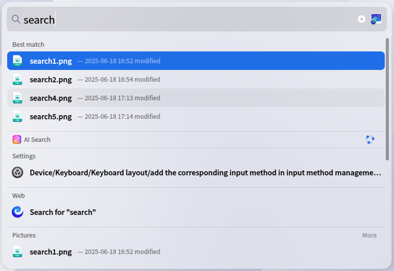
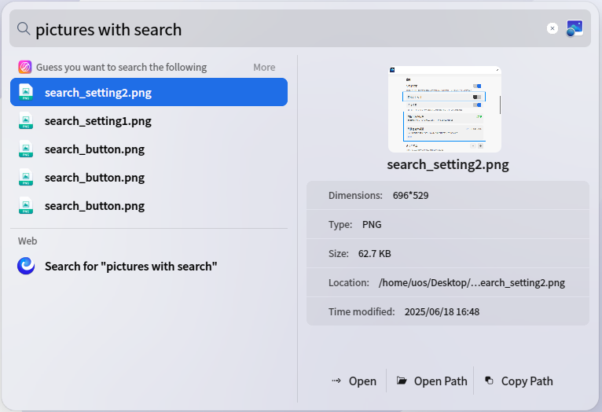
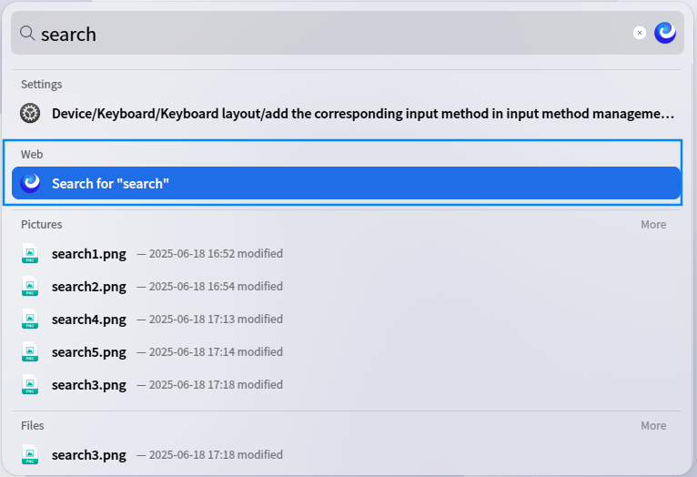
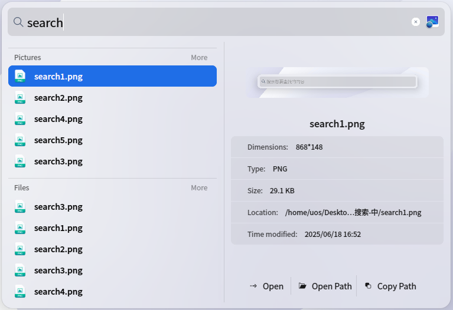
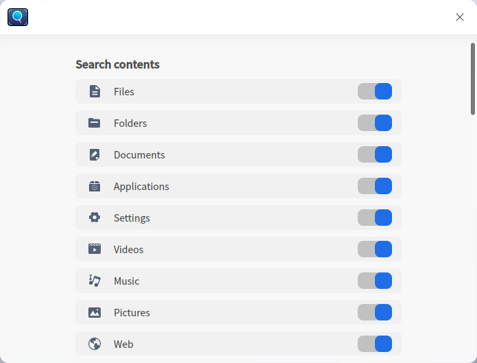
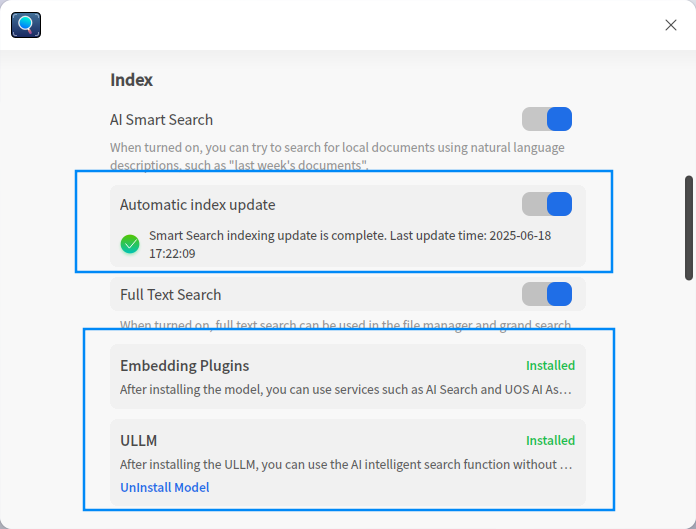

# Grand Search|dde-grand-search|

## Overview

Grand Search is a system-level quick retrieval tool that can be invoked via the taskbar or a shortcut key. Enter keywords to search for applications, files, settings, multimedia content, etc., in real time. It supports categorized display and quick preview operations, helping you efficiently locate system resources.

## Opening Methods

### Invocation Methods
* Click  on the taskbar or use the shortcut **Shift+Space** to bring up the search box.

### Closing Methods
* Click anywhere outside the search box or press the **Esc** key to close it.

## Searching for Files

### Basic Search
* Enter keywords in the search box. Results appear instantly as you type.
* Results are categorized by type: Files, Folders, Documents, Applications, Settings, Videos, Music, Images.
* The top result is recommended as the best match.

### AI Search
* Enter a natural language description related to files. AI Search will find files based on your description.
* For documents, describe time or content, e.g., "Last week's documents."
* For images, describe text within the image, e.g., "Images containing 'search'."

### Web Search
* Under the **Web Search** category in results, click **Search in Browser** to find information online.

### Previewing and Opening Results
* Use **↑/↓ arrow keys** or left-click to select a result.
* Double-click or press **Enter** to open the file.
* The preview panel (right) shows thumbnails, properties, and content. Actions: **Open File**, **Open Path**, **Copy Path**.

## Search Configuration
Right-click  on the taskbar and select **Search Settings** to configure.

### Search Scope
* Toggle categories (**Files, Folders, Documents, Apps, Settings, Videos, Music, Images, Web Search**) to include/exclude them from results.

### Indexing
**AI Smart Search**
* Enable **AI Smart Search** to use AI features.
* Install **Vectorization Model Plugin** and **Tongxin Youreng LLM**.
* Enable **Auto-Update Index** for real-time AI indexing.
* Enable **Full-Text Search** to search file contents via AI.

**Path Blacklist**
* Add paths you wish to exclude from searches using the / buttons. Files in these paths won’t appear in results.

### Personalization
**Trailing Settings**
* Check **Parent Directory** or **Last Modified Time** to display these details below search results.

**Best Match**
* Enable **Best Match** to show top results in a dedicated category.

**Default Search Engine**
* Select a **Default Search Engine** for Web Search queries.