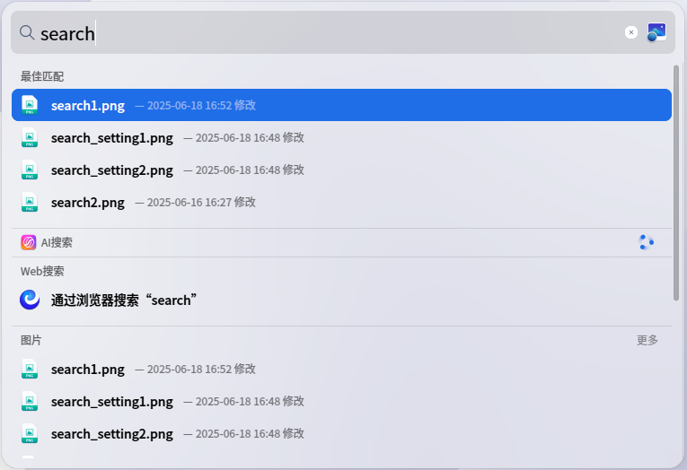
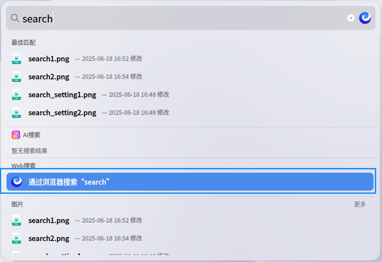
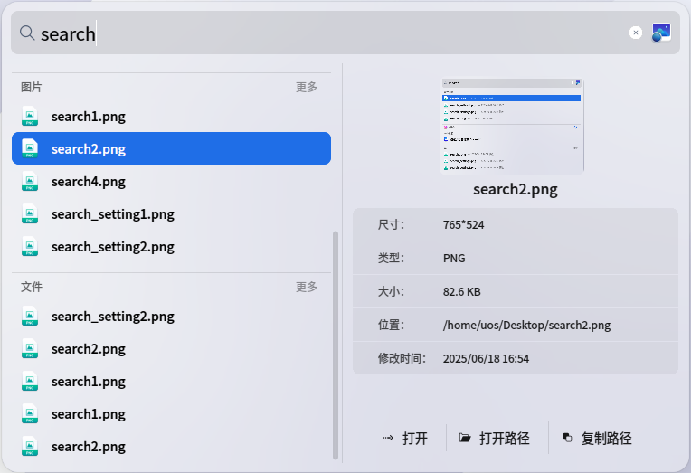
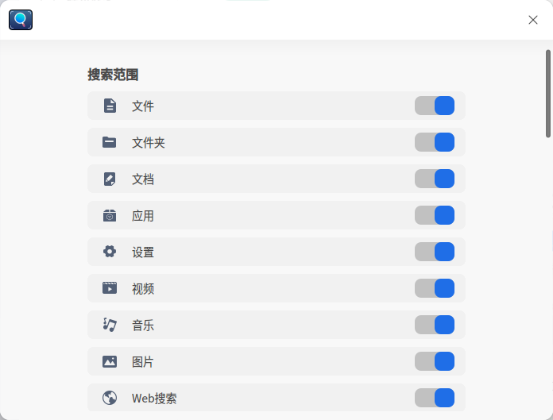

# 全局搜索|dde-grand-search|

## 概述

全局搜索是系统级快速检索工具，通过任务栏入口或快捷键一键唤出。输入关键词即可实时检索应用、文件、设置、影音等内容，支持分类展示与快速预览操作，帮助您高效定位系统资源。 

## 打开方式

### 唤出方式

* 在任务栏上单击，或使用快捷键 **Shift+Space** 唤起搜索框。

### 关闭方式

* 单击搜索框外任意区域，或使用快捷键 Esc关闭搜索框。

## 搜索文件

### 普通搜索

* 在搜索框中，输入要查找的文件关键词，输入时会立即出现搜索结果。
* 搜索结果将按照文件类型分类展示，包括文件、文件夹、文档、应用、设置、视频、音乐、图片。
* 搜索结果列表顶部将为您推荐最佳匹配结果。

### Web搜索

在搜索结果列表的Web 搜索分组中，点击 **通过浏览器搜索** ，可以在浏览器中搜索您需要的信息。

### 预览和打开搜索结果

* 使用键盘上下方向键，或鼠标左键点击选中搜索结果。

* 选中搜索结果后，您可以双击打开文件，也可以使用回车打开文件。

* 搜索结果面板右侧预览区将显示文件缩略图、文件属性、文件内容等预览信息。在预览区可以 **打开文件** 、 **打开路径** 、 **复制路径**。

## 搜索配置

在任务栏上鼠标右键单击 **搜索配置** ， 打开搜索配置窗口。

### 搜索范围

* 配置展示在搜索结果列表中的文件类目，打开 **文件  件夹 文档  应用 设置 视频 音乐 图片 Web搜索** 类目开关，搜索结果列表将显示对应分组。

### 索引

**路径黑名单**

* 如果您有不希望被搜到的文件路径，可以通过按钮将其添加到路径黑名单，搜索结果中将不会出现这些路径下的文件。

### 个性化

**拖尾设置**

* 勾选**上级目录**、**最近修改时间**，搜索结果尾部将显示已勾选的拖尾项目。

**最佳匹配**

* 打开 **最佳匹配** 开关，搜索结果列表将显示最佳匹配分组。

**默认搜索引擎**

* 选择 **默认搜索引擎** 后，Web 搜索中将使用默认搜索引擎进行搜索。
