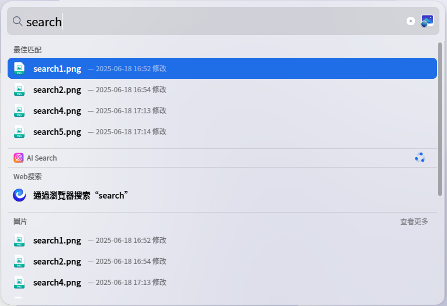
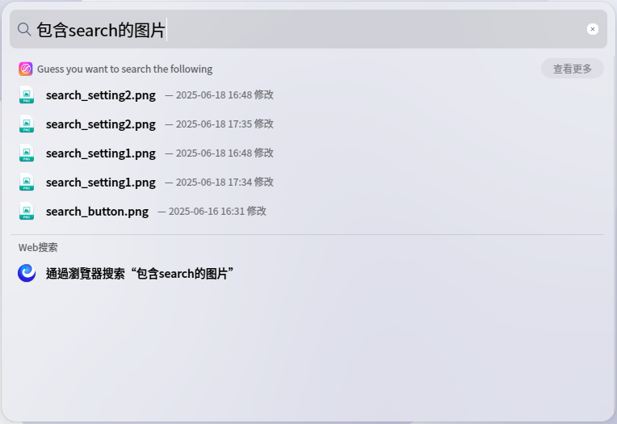
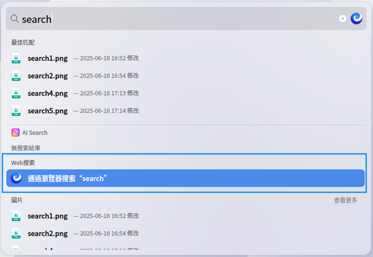
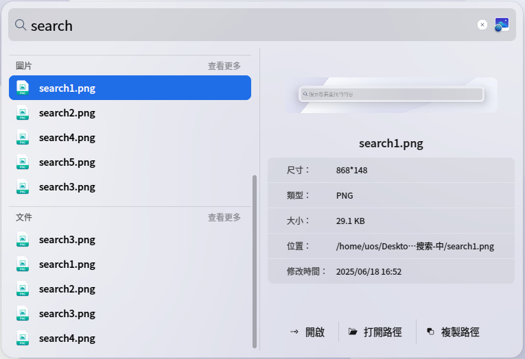
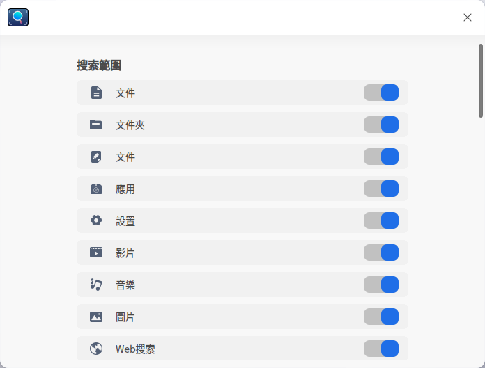
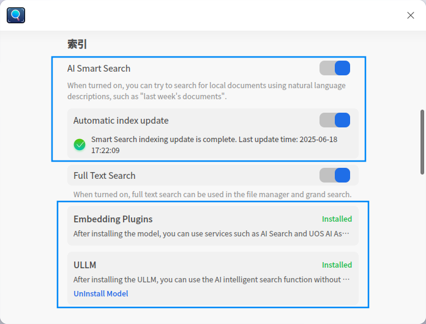

# 全局搜索|dde-grand-search|

## 概述

全局搜索是系統級快速檢索工具，透過工作列入口或快速鍵一鍵開啟。輸入關鍵字即可即時搜尋應用程式、檔案、設定、影音等內容，支援分類展示與快速預覽操作，助您高效定位系統資源。

## 開啟方式

### 喚出方式
* 在工作列上點擊 ，或使用快速鍵 **Shift+Space** 開啟搜尋框。

### 關閉方式
* 點擊搜尋框外任意區域，或使用快速鍵 **Esc** 關閉搜尋框。

## 搜尋檔案

### 普通搜尋
* 在搜尋框中輸入關鍵字，輸入時即時顯示結果。
* 結果按類型分類：檔案、資料夾、文件、應用程式、設定、影片、音樂、圖片。
* 結果列表頂部將推薦最佳匹配項目。

### AI 搜尋
* 輸入一句與檔案相關的自然語言描述，AI 將據此搜尋檔案。
* 搜尋文件時，可描述時間或內容，例如「上週的文件」。
* 搜尋圖片時，可描述圖中文字，例如「包含 'search' 的圖片」。

### 網頁搜尋
* 在結果列表的「網頁搜尋」分組中，點擊 **透過瀏覽器搜尋** 以線上搜尋資訊。

### 預覽及開啟結果
* 使用鍵盤 **↑/↓ 方向鍵** 或滑鼠左鍵選取結果。
* 雙擊或按 **Enter** 開啟檔案。
* 右側預覽區顯示縮圖、屬性及內容。操作：**開啟檔案**、**開啟路徑**、**複製路徑**。

## 搜尋設定
在工作列  上右鍵點擊 **搜尋設定** 以配置。

### 搜尋範圍
* 啟用/停用類別開關（**檔案、資料夾、文件、應用程式、設定、影片、音樂、圖片、網頁搜尋**），控制結果展示。

### 索引
**AI 智能搜尋**
* 啟用 **AI 智能搜尋** 以使用 AI 功能。
* 安裝 **向量化模型插件** 及 **統信有容大模型**。
* 啟用 **自動更新索引** 以即時更新 AI 索引。
* 啟用 **全文檢索** 可在 AI 搜尋中匹配檔案內容。

**路徑黑名單**
* 透過 / 按鈕新增需排除的路徑，該路徑下檔案將不會出現在結果中。

### 個人化
**拖尾設定**
* 勾選 **上層目錄** 或 **最近修改時間**，結果尾部將顯示對應資訊。

**最佳匹配**
* 啟用 **最佳匹配** 開關，結果列表將顯示最佳匹配分組。

**預設搜尋引擎**
* 選擇 **預設搜尋引擎**，網頁搜尋將使用此引擎執行查詢。
